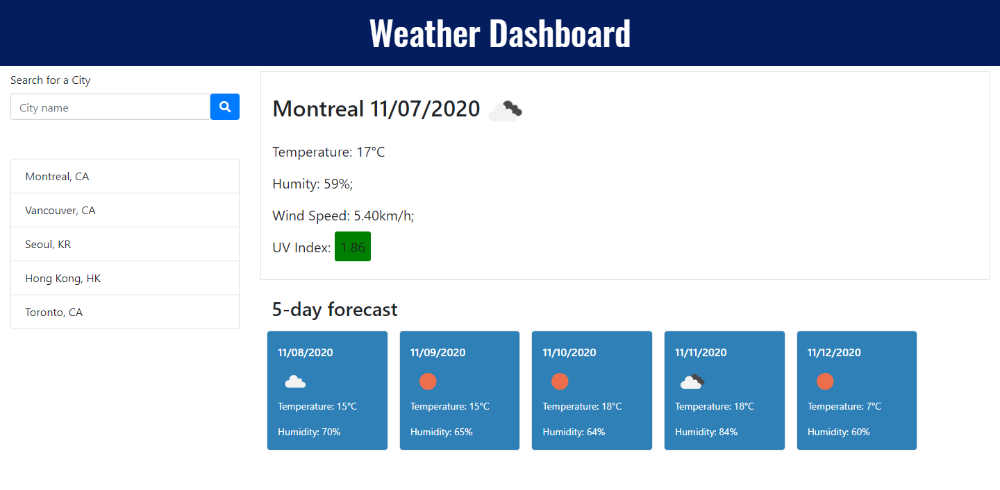

# Weather-Dashboard

## Description
This website is a Weather Dasboard employs [OpenWeatherMap API](https://openweathermap.org/api). The dashboard allows user to search for a city and get the weather for that city.

The website uses a Bootstrap framework for a responsive layout. Javascript with JQuerywas used to implement the weather dashboard by dynamically changing the content of the html and stylesheet. Also, to store the search history, local storage was used. 

Here is the outline of the website works.
1. The user can search for a city in the search bar to get the current and future conditions foor that city.
2. The city that was search is added to top of the search history. There is a maximum of ten cities that can be displayed in the search history.
3. There is a top section for the current weather of that city. The name of the city, the date, an icon represetation of the weather condition, the temperature, the humidity, the wind speed and the uv index are shown.
4. The uv index is shown in colour coded using a [standard colour code](https://www.canada.ca/en/environment-climate-change/services/weather-health/uv-index-sun-safety.html).
5. There is a bottom section for the 5 day forecast of that city. It contains for the next 5 days thhe date, an icon represetation of the weather condition, the temperature and the humidity. 
6. The OpenWeatherMap provides the list of data of 40 entries at 3 hour intervals. The data shown in the 5 day forecast was closest to 12 PM local time. Also, depending on when the API was called, there may not be adequate data for the 5th day after the current day. Instead of the next 5 days, the 5-day forecast will include the current day as well.
7. The user can click on a city in the search history to get the current weather and forecast of that city again. The city will move to the top of the search history.

Here are the screenshots of weather dashboard.
 

Link to the Github repository: https://github.com/akwanmtl/Weather-Dashboard

Link to the website: https://akwanmtl.github.io/Weather-Dashboard/

## Credits

* [OpenWeatherMap](https://https://openweathermap.org/)
* [License badge link](https://gist.github.com/lukas-h/2a5d00690736b4c3a7ba)

## License

Copyright (c) [2020] [Annie Kwan]
